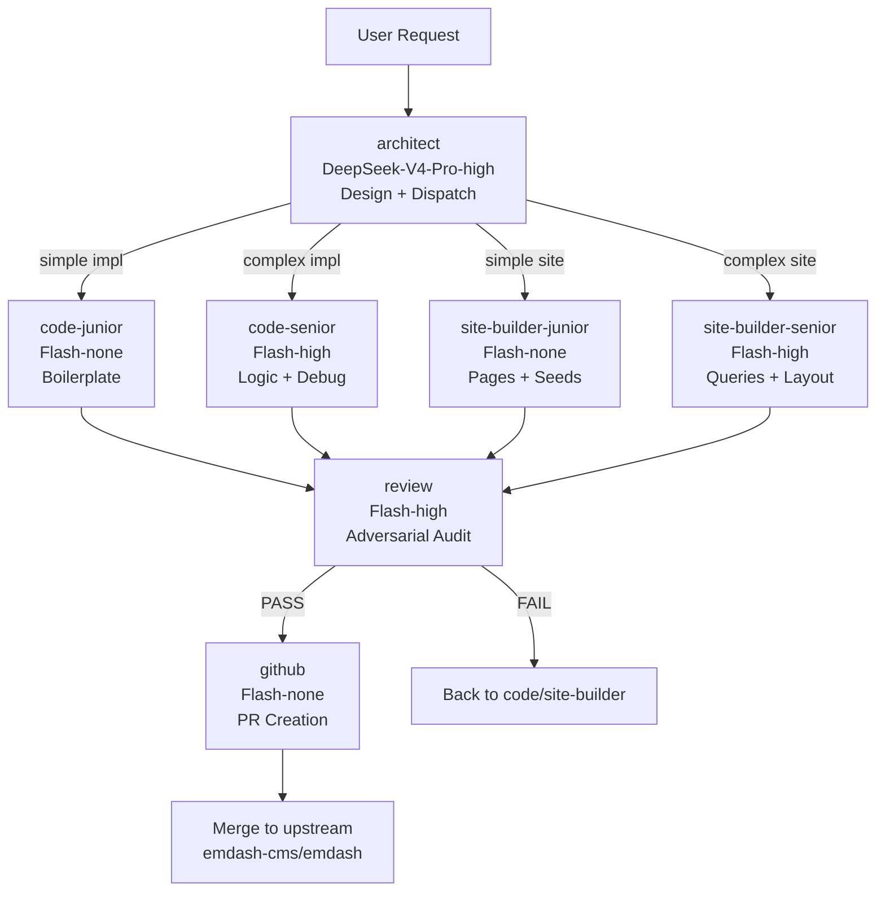
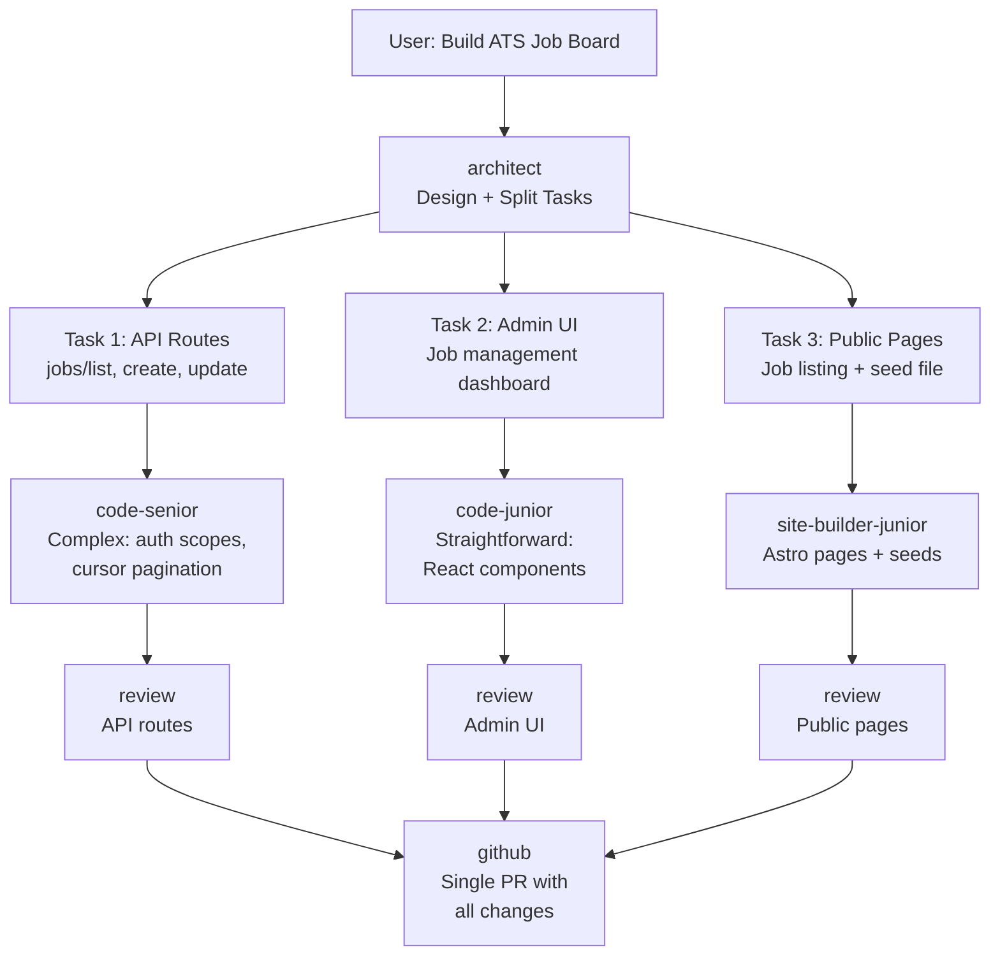
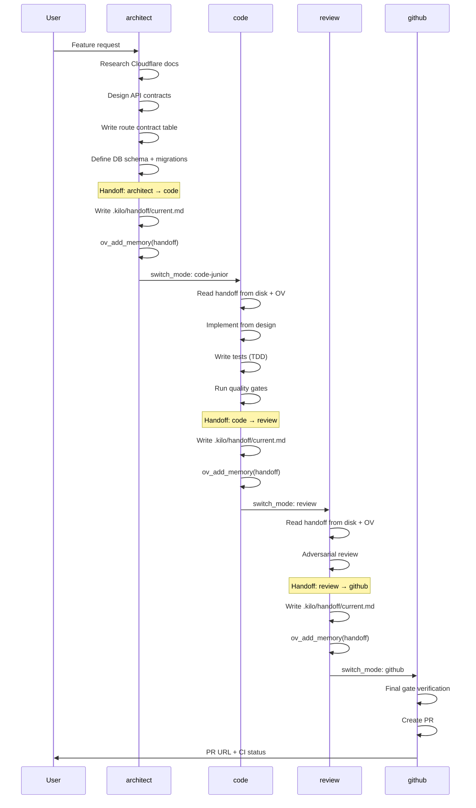

# EmDash Agent Engineering Team

**Version:** 1.0
**Date:** 2026-05-01
**Status:** Active
**Architect:** Kilo (architect agent)

---

## Table of Contents

1. [Organisation Chart](#organisation-chart)
2. [Agent Profiles](#agent-profiles)
3. [Pipeline Flow](#pipeline-flow)
4. [Dispatch Decision Matrix](#dispatch-decision-matrix)
5. [Research Separation Principle](#research-separation-principle)
6. [Testing Responsibility Matrix](#testing-responsibility-matrix)
7. [Stage-Gate Parallel Execution](#stage-gate-parallel-execution)
8. [Skill Distribution Map](#skill-distribution-map)
9. [Model & Cost Profile](#model--cost-profile)
10. [Team Evolution](#team-evolution)
11. [GitHub Production Line](#github-production-line)

---

## Organisation Chart

```
┌─────────────────────────────────────────────────────────────────┐
│                        ENDASH AGENT TEAM                        │
│                      5 slots · 3 roles · 2 gates                │
├─────────────────────────────────────────────────────────────────┤
│                                                                 │
│   USER                                                          │
│    │                                                            │
│    ▼                                                            │
│   ┌──────────────────────────────────┐                          │
│   │         ARCHITECT                │  DEFAULT AGENT           │
│   │   DeepSeek-V4-Pro-high (think)   │  Design + Dispatch       │
│   │   4 skills · docs MCP · vision   │                          │
│   └──────────┬───────────────────────┘                          │
│              │                                                  │
│     ┌────────┼────────┬────────────┐                            │
│     │        │        │            │                            │
│     ▼        ▼        ▼            ▼                            │
│   ┌─────┐ ┌─────┐ ┌────────┐ ┌────────┐    IMPLEMENTATION      │
│   │ C-J │ │ C-S │ │  SB-J  │ │  SB-S  │    (parallel)          │
│   │     │ │     │ │        │ │        │                         │
│   │none │ │high │ │  none  │ │  high  │                         │
│   └──┬──┘ └──┬──┘ └───┬────┘ └───┬────┘                         │
│      │       │        │          │                              │
│      └───────┴────────┴──────────┘                              │
│                    │                                            │
│                    ▼                                            │
│          ┌──────────────────┐                                   │
│          │     REVIEW       │    QUALITY GATE                   │
│          │  Flash-high      │    Adversarial audit              │
│          │  4 skills        │                                   │
│          └────────┬─────────┘                                   │
│                   │                                             │
│                   ▼                                             │
│          ┌──────────────────┐                                   │
│          │     GITHUB       │    PIPELINE TERMINUS              │
│          │  Flash-none      │    PR creation                    │
│          │  1 skill         │                                   │
│          └──────────────────┘                                   │
│                                                                 │
│   LEGEND:                                                       │
│   C-J = code-junior (Flash-none)    SB-J = site-builder-junior  │
│   C-S = code-senior (Flash-high)    SB-S = site-builder-senior  │
│                                                                 │
└─────────────────────────────────────────────────────────────────┘
```

---

## Agent Profiles

### 1. Architect

| Attribute    | Value                                      |
| ------------ | ------------------------------------------ |
| **Agent ID** | `architect`                                |
| **Role**     | Principal System Architect                 |
| **Model**    | `litellm/DeepSeek-V4-Pro-high`             |
| **Thinking** | Always on (reasoning essential for design) |
| **Default**  | Yes — `default_agent: "architect"`         |
| **Session**  | `kilo-context-architect`                   |
| **Prompt**   | `.kilo/agent/architect.md`                 |

**Skills:**

| Skill                        | Purpose                                                                       |
| ---------------------------- | ----------------------------------------------------------------------------- |
| `cloudflare-agents-sdk`      | Worker/Agent architecture decisions, state model design, scheduling patterns  |
| `cloudflare-durable-objects` | DO state model, alarm patterns, routing strategy, anti-pattern avoidance      |
| `designer-reference`         | Kumo component gallery, color tokens, layout patterns, visual design analysis |
| `openviking-agent-config`    | Session lifecycle, memory persistence, pattern discovery                      |

**Tools:**

| Tool                                              | Use                                                           |
| ------------------------------------------------- | ------------------------------------------------------------- |
| `cloudflare-docs_search_cloudflare_documentation` | Real-time Cloudflare docs lookup during design                |
| `cloudflare-docs_migrate_pages_to_workers_guide`  | Pages → Workers migration reference                           |
| `openviking_ov_*`                                 | Knowledge base search, memory persistence, session management |
| `bash`                                            | Git operations, lint/typecheck/test verification              |
| `read` / `glob` / `grep`                          | Codebase exploration, pattern discovery                       |
| `edit` / `write`                                  | Design documents, agent prompt updates                        |
| `task` (general, explore)                         | Sub-agent dispatch for codebase research                      |
| `skill`                                           | Skill loading, registration                                   |
| `kilo-playwright_browser_*`                       | Browser-based visual verification when needed                 |
| `webfetch`                                        | External documentation retrieval                              |

**Responsibilities:**

- Entry point for all user requests
- Task triage and complexity assessment
- ALL Cloudflare/Infrastructure research
- API contract design (types, endpoints, handlers)
- Database schema design (tables, columns, indexes, migrations)
- Route contract tables (frontend call → backend route mapping)
- Edge case enumeration and error handling design
- Cloudflare primitive selection (DO vs KV vs Queue vs Workflow)
- Wrangler configuration design
- Visual design analysis and design briefs
- Pipeline routing and agent dispatch
- Junior vs senior mode selection
- Cross-layer impact assessment (demos/templates affected?)

**Handoff Format:**

```
## Handoff: architect → {code|site-builder}-{junior|senior}

### Summary
[What needs to be built, key design decisions, rationale]

### Design
- Affected Files
- Contracts (types, API endpoints, data shapes)
- Data Flow
- Edge Cases to Handle
- Migration Required?
- Tests Needed

### Cloudflare Notes (if applicable)
- Primitive selection + rationale
- Wrangler config snippet
- State schema (SQL/KV)
- Routing strategy
- Anti-patterns to avoid

### Cross-Layer Impact
[Templates affected? site-builder required?]
```

---

### 2. Code (Junior)

| Attribute    | Value                                                            |
| ------------ | ---------------------------------------------------------------- |
| **Agent ID** | `code-junior`                                                    |
| **Role**     | Implementation Engineer — Straightforward Tasks                  |
| **Model**    | `litellm/DeepSeek-V4-Flash-none`                                 |
| **Thinking** | Off (no reasoning overhead)                                      |
| **Session**  | `kilo-context-code`                                              |
| **Prompt**   | `.kilo/agent/code-junior.md` (shares body with `code-senior.md`) |

**Skills:**

| Skill                        | Purpose                                                               |
| ---------------------------- | --------------------------------------------------------------------- |
| `creating-plugins`           | `definePlugin()` API, hooks, storage, settings, admin UI, block types |
| `emdash-cli`                 | Test commands, content seeding, schema management                     |
| `agent-browser`              | Browser automation for E2E tests, admin UI verification               |
| `wordpress-plugin-to-emdash` | WordPress plugin migration                                            |
| `openviking-agent-config`    | Session lifecycle, memory persistence                                 |

**Cost Profile:** Lowest — No reasoning tokens. ~80% of implementation tasks.

**Best For:**

- Wiring new endpoints from existing specs
- Adding fields to existing collections
- Cloning existing component patterns
- Straightforward CRUD operations
- Admin UI components from design
- Plugin scaffolding
- Simple middleware
- Changeset creation

---

### 3. Code (Senior)

| Attribute    | Value                                                            |
| ------------ | ---------------------------------------------------------------- |
| **Agent ID** | `code-senior`                                                    |
| **Role**     | Implementation Engineer — Complex Tasks                          |
| **Model**    | `litellm/DeepSeek-V4-Flash-high`                                 |
| **Thinking** | On (reasoning for logic verification)                            |
| **Session**  | `kilo-context-code`                                              |
| **Prompt**   | `.kilo/agent/code-senior.md` (shares body with `code-junior.md`) |

**Skills:** Same as code-junior.

**Cost Profile:** 2x–5x higher than junior (reasoning tokens). ~20% of implementation tasks.

**Best For:**

- Multi-step state machines
- Race condition fixes
- N+1 query optimization
- Hard-to-reproduce bugs
- New patterns with no prior art
- Complex auth flows
- Database migration logic
- Performance-critical paths

---

### 4. Site Builder (Junior)

| Attribute    | Value                                                                            |
| ------------ | -------------------------------------------------------------------------------- |
| **Agent ID** | `site-builder-junior`                                                            |
| **Role**     | Site Builder — Straightforward Pages                                             |
| **Model**    | `litellm/DeepSeek-V4-Flash-none`                                                 |
| **Thinking** | Off                                                                              |
| **Session**  | `kilo-context-site-builder`                                                      |
| **Prompt**   | `.kilo/agent/site-builder-junior.md` (shares body with `site-builder-senior.md`) |

**Skills:**

| Skill                       | Purpose                                                                    |
| --------------------------- | -------------------------------------------------------------------------- |
| `building-emdash-site`      | Astro pages, collections, seeds, Portable Text, menus, taxonomies, widgets |
| `emdash-cli`                | Content seeding, schema management                                         |
| `wordpress-theme-to-emdash` | WordPress theme migration                                                  |
| `openviking-agent-config`   | Session lifecycle                                                          |

**Cost Profile:** Lowest. ~80% of site tasks.

**Best For:**

- Adding pages from a complete Design Brief
- Writing seed files
- Defining collections
- Menu and taxonomy configuration
- Simple widget setup
- WordPress theme migration

---

### 5. Site Builder (Senior)

| Attribute    | Value                                                                            |
| ------------ | -------------------------------------------------------------------------------- |
| **Agent ID** | `site-builder-senior`                                                            |
| **Role**     | Site Builder — Complex Pages & Queries                                           |
| **Model**    | `litellm/DeepSeek-V4-Flash-high`                                                 |
| **Thinking** | On                                                                               |
| **Session**  | `kilo-context-site-builder`                                                      |
| **Prompt**   | `.kilo/agent/site-builder-senior.md` (shares body with `site-builder-junior.md`) |

**Skills:** Same as site-builder-junior.

**Cost Profile:** 2x–5x higher. ~20% of site tasks.

**Best For:**

- Complex content queries (multi-join, aggregation)
- Portable Text rendering logic
- Cursor-based pagination in templates
- Layout debugging across breakpoints
- Performance optimization (large seed files)
- Advanced taxonomy filtering

---

### 6. Review

| Attribute    | Value                                   |
| ------------ | --------------------------------------- |
| **Agent ID** | `review`                                |
| **Role**     | Adversarial Code Reviewer               |
| **Model**    | `litellm/DeepSeek-V4-Flash-high`        |
| **Thinking** | On (reasoning for adversarial analysis) |
| **Session**  | `kilo-context-review`                   |
| **Prompt**   | `.kilo/agent/review.md`                 |

**Skills:**

| Skill                        | Purpose                                          |
| ---------------------------- | ------------------------------------------------ |
| `adversarial-reviewer`       | Systematic bug hunting, logic hole detection     |
| `cloudflare-agents-sdk`      | Verify Worker/Agent patterns in implemented code |
| `cloudflare-durable-objects` | Verify DO state patterns, anti-pattern detection |
| `openviking-agent-config`    | Session lifecycle                                |

**Review Checklist:**

1. **Logic & Correctness**
   - Content queries filter by `locale` where required
   - `entry.id` (slug) vs `entry.data.id` (ULID) used correctly
   - Taxonomy names match seed definitions
   - Cursor pagination shape correct: `{ items, nextCursor }`
   - Optimistic concurrency tokens (`_rev`) validated on update

2. **Edge Cases & Error Handling**
   - Empty results handled (200 with empty items[])
   - Missing fields, null bylines don't crash
   - Catch blocks use `handleError()`, never expose `error.message`
   - API routes use `apiError()` and `parseBody()`
   - 400 for malformed input, not 500 from uncaught exception

3. **State & Concurrency**
   - No TOCTOU races (check-then-act without locking)
   - Scheduled publishing uses proper partial indexes
   - No stale closure issues in hooks or middleware

4. **SQL & Security**
   - No string interpolation into SQL
   - `sql.raw()` only with `validateIdentifier()`
   - State-changing routes check CSRF (`X-EmDash-Request: 1`)
   - State-changing routes check authorization (`requireRole`)
   - Dev-only endpoints gated by `import.meta.env.DEV`

5. **Data Integrity & Migrations**
   - New columns in WHERE/ORDER BY have indexes
   - FK columns indexed
   - Migrations forward-only (no data loss)
   - Migration handles all content tables

6. **i18n & RTL**
   - Admin UI strings through Lingui (`t` macro or `<Trans>`)
   - Admin layout classes RTL-safe (logical: `ms-*`, `ps-*`, `start-*`)
   - No bare English strings in JSX, aria labels, titles, placeholders

7. **Cloudflare Patterns (if applicable)**
   - Correct DO routing strategy
   - `blockConcurrencyWhile` only in constructor
   - State persisted before in-memory cache
   - One alarm per DO
   - No single global DO bottleneck

8. **Quality Gate Verification**
   - Lint clean
   - Typecheck passes
   - Tests pass
   - Format applied
   - Changeset present (if packages changed)

**Verdict:** PASS → dispatch to `github`. FAIL → dispatch back to code/site-builder with bug list.

---

### 7. GitHub

| Attribute    | Value                            |
| ------------ | -------------------------------- |
| **Agent ID** | `github`                         |
| **Role**     | PR Creator                       |
| **Model**    | `litellm/DeepSeek-V4-Flash-none` |
| **Thinking** | Off (mechanical PR creation)     |
| **Session**  | `kilo-context-github`            |
| **Prompt**   | `.kilo/agent/github.md`          |

**Skills:**

| Skill                     | Purpose           |
| ------------------------- | ----------------- |
| `openviking-agent-config` | Session lifecycle |

**Tools:**

| Tool                 | Use                                  |
| -------------------- | ------------------------------------ |
| `bash` (git, gh CLI) | Branch management, push, PR creation |
| `github_*` MCP tools | Issue/PR reading, CI status checking |
| `read`               | PR template, changeset files         |
| `openviking_ov_*`    | Session management                   |

**Workflow:**

1. Verify branch state (not `main`, clean working tree)
2. Push to origin (`agentcafe/emdash` fork)
3. Run final quality gate verification
4. Build PR title (`feat(scope): description`)
5. Fill PR template from `.github/PULL_REQUEST_TEMPLATE.md`
6. Create PR via `gh pr create` targeting `emdash-cms/emdash`
7. Report PR URL and CI status

**Pipeline Terminus:** No further handoff. Pipeline ends here.

---

## Pipeline Flow

### Primary Pipeline



### Parallel Dispatch Flow



### Handoff Chain



---

## Dispatch Decision Matrix

### Code: Junior vs Senior

```
┌──────────────────────────────────────────────────────────────────┐
│                    CODE DISPATCH GATE                             │
│                                                                  │
│  Task has any of:                                                │
│    □ Multi-step state machine                                    │
│    □ Race condition / concurrency concern                        │
│    □ N+1 query or performance issue                              │
│    □ Hard-to-reproduce bug (no existing test)                    │
│    □ New pattern with no prior art in codebase                   │
│    □ Complex auth flow (OAuth, MFA, token exchange)              │
│    □ Database migration with data transformation                 │
│                                                                  │
│  IF ANY CHECKED → code-senior (Flash-high, thinking)             │
│  IF NONE CHECKED → code-junior (Flash-none, no thinking)         │
│                                                                  │
│  Examples:                                                       │
│  ┌─────────────────────────────────┬──────────────────────────┐  │
│  │ Wire GET /posts from spec       │ code-junior              │  │
│  │ Add `excerpt` field to posts    │ code-junior              │  │
│  │ Clone existing Dialog component │ code-junior              │  │
│  │ Scaffold new plugin             │ code-junior              │  │
│  │ Fix scheduled-publish race      │ code-senior              │  │
│  │ Implement OAuth device flow     │ code-senior              │  │
│  │ Debug stale closure in hook     │ code-senior              │  │
│  │ Optimize N+1 content query      │ code-senior              │  │
│  │ Migrate data across schemas     │ code-senior              │  │
│  │ Fix CSRF bypass vulnerability   │ code-senior              │  │
│  └─────────────────────────────────┴──────────────────────────┘  │
└──────────────────────────────────────────────────────────────────┘
```

### Site Builder: Junior vs Senior

```
┌──────────────────────────────────────────────────────────────────┐
│                 SITE BUILDER DISPATCH GATE                        │
│                                                                  │
│  Task has any of:                                                │
│    □ Complex content query (multi-join, aggregation)              │
│    □ Portable Text rendering with custom serializers             │
│    □ Cursor-based pagination in template                         │
│    □ Layout debugging across responsive breakpoints              │
│    □ Performance issue with large seed files                     │
│    □ Advanced taxonomy filtering with nested conditions          │
│    □ Complex menu with dynamic items                             │
│                                                                  │
│  IF ANY CHECKED → site-builder-senior (Flash-high, thinking)     │
│  IF NONE CHECKED → site-builder-junior (Flash-none, no thinking) │
│                                                                  │
│  Examples:                                                       │
│  ┌─────────────────────────────────┬──────────────────────────┐  │
│  │ Add about page from brief       │ site-builder-junior      │  │
│  │ Write post seed file            │ site-builder-junior      │  │
│  │ Define blog collection          │ site-builder-junior      │  │
│  │ Set up main navigation menu     │ site-builder-junior      │  │
│  │ Complex facet search query      │ site-builder-senior      │  │
│  │ Custom PT block renderer        │ site-builder-senior      │  │
│  │ Debug mobile layout break       │ site-builder-senior      │  │
│  │ Optimize 10k-record seed file   │ site-builder-senior      │  │
│  └─────────────────────────────────┴──────────────────────────┘  │
└──────────────────────────────────────────────────────────────────┘
```

---

## Research Separation Principle

```
┌──────────────────────────────────────────────────────────────────┐
│              RESEARCH SEPARATION BOUNDARY                         │
│                                                                  │
│  ARCHITECT (research zone)          DOERS (implementation zone)  │
│  ┌────────────────────────┐        ┌────────────────────────┐    │
│  │ Cloudflare docs search │        │                        │    │
│  │ Agents SDK patterns    │        │  Receive complete      │    │
│  │ Durable Object design  │───────▶│  implementation        │    │
│  │ Wrangler config        │        │  spec                  │    │
│  │ Primitive selection    │        │                        │    │
│  │ Anti-pattern avoidance │        │  Implement from spec   │    │
│  └────────────────────────┘        │                        │    │
│                                     │  Do NOT research       │    │
│                                     │  Cloudflare docs       │    │
│                                     │                        │    │
│                                     │  If ambiguity → flag   │    │
│                                     │  back to architect     │    │
│                                     └────────────────────────┘    │
│                                                                  │
│  REVIEW (verification zone)                                      │
│  ┌────────────────────────────────────────────────────────────┐  │
│  │ Has Cloudflare skills to VERIFY patterns                   │  │
│  │ in implemented code, but does NOT research                 │  │
│  │ new patterns — that's architect's job.                     │  │
│  └────────────────────────────────────────────────────────────┘  │
└──────────────────────────────────────────────────────────────────┘
```

**What the architect's Cloudflare research produces for the doer:**

1. **Primitive selection** — "Use DO with SQLite, not KV, because you need to query jobs by status + scheduled_for"
2. **Wrangler config** — Exact JSONC snippet for bindings + migrations
3. **State schema** — SQL DDL with indexes
4. **Routing strategy** — `getByName` vs `newUniqueId` vs `idFromString`
5. **Alarm pattern** — When to set, when to delete, what the handler does
6. **Anti-patterns** — "DO NOT: blockConcurrencyWhile on request handler. DO NOT: setInterval in DO."
7. **Concurrency model** — Where locks are needed, where they'd throttle

---

## Testing Responsibility Matrix

```
┌──────────────────────────────────────────────────────────────────┐
│                     TESTING RESPONSIBILITY                        │
│                                                                  │
│  PHASE          │ WHO              │ WHAT                        │
│  ───────────────┼──────────────────┼─────────────────────────────│
│  Design         │ architect        │ Specifies test requirements │
│                 │                  │ in handoff:                 │
│                 │                  │ "Unit: handler returns      │
│                 │                  │  ApiResponse<Foo>"          │
│                 │                  │ "Integration: e2e flow      │
│                 │                  │  through route"             │
│  ───────────────┼──────────────────┼─────────────────────────────│
│  Implementation │ code/site-builder│ TDD for bugs: write failing │
│                 │                  │ test → fix → verify         │
│                 │                  │ Write tests alongside code  │
│  ───────────────┼──────────────────┼─────────────────────────────│
│  Quality Gate   │ code/site-builder│ pnpm --silent lint:quick    │
│  (before        │                  │ pnpm typecheck              │
│   handoff)      │                  │ pnpm test                   │
│                 │                  │ pnpm test:browser (if admin)│
│                 │                  │ pnpm test:e2e (if full-stk) │
│                 │                  │ pnpm format                 │
│  ───────────────┼──────────────────┼─────────────────────────────│
│  Verification   │ review           │ Verifies all gates passed   │
│                 │                  │ Does NOT re-run tests       │
│                 │                  │ Adversarial code review     │
│  ───────────────┼──────────────────┼─────────────────────────────│
│  Final Gate     │ github           │ Final verification before   │
│                 │                  │ PR creation                 │
└──────────────────────────────────────────────────────────────────┘

                  TEST TIERS BY WHEN THEY RUN

  ┌──────────────┬──────────────────────────────┬─────────────────┐
  │ Tier         │ Command                      │ Runs When       │
  ├──────────────┼──────────────────────────────┼─────────────────┤
  │ Lint         │ pnpm --silent lint:quick     │ Every edit      │
  │ Typecheck    │ pnpm typecheck               │ After each round│
  │ Unit + Int   │ pnpm test                    │ Before handoff  │
  │ Admin        │ pnpm test:browser            │ Admin UI changed│
  │ E2E          │ pnpm test:e2e                │ Full-stack flow │
  │ Format       │ pnpm format                  │ Before commit   │
  │ Changeset    │ pnpm changeset               │ Packages changed│
  └──────────────┴──────────────────────────────┴─────────────────┘
```

---

## Stage-Gate Parallel Execution

```
┌──────────────────────────────────────────────────────────────────┐
│               STAGE-GATE PARALLEL EXECUTION PATTERN               │
│                                                                  │
│  STAGE: "Build ATS Job Board"                                    │
│                                                                  │
│  ARCHITECT designs the full system:                              │
│    • API contracts (jobs/list, create, update, delete)           │
│    • DB schema (ec_jobs table + migration)                       │
│    • Route contract table                                        │
│    • Admin UI component tree                                     │
│    • Public page layout                                          │
│    • Seed file schema                                            │
│                                                                  │
│  ═══════════════ PARALLEL DISPATCH ═══════════════               │
│                                                                  │
│  ┌─────────────────┐  ┌─────────────────┐  ┌─────────────────┐   │
│  │ code-senior     │  │ code-junior     │  │ site-junior     │   │
│  │                 │  │                 │  │                 │   │
│  │ API routes      │  │ Admin UI        │  │ Public pages    │   │
│  │ jobs/list       │  │ JobDashboard    │  │ /jobs page      │   │
│  │ jobs/create     │  │ JobEditor       │  │ /jobs/[slug]    │   │
│  │ jobs/update     │  │ JobList         │  │ Seed file       │   │
│  │ jobs/delete     │  │ Filters         │  │ Collection def  │   │
│  │ Auth scopes     │  │                 │  │                 │   │
│  │ DB migration    │  │                 │  │                 │   │
│  └────────┬────────┘  └────────┬────────┘  └────────┬────────┘   │
│           │                    │                    │            │
│  ════════════════ STAGE GATE: REVIEW ════════════════            │
│                                                                  │
│  ┌─────────────────────────────────────────────────────────────┐ │
│  │ review verifies each sub-system independently              │ │
│  │ All three reviews pass → integrated PR                     │ │
│  └─────────────────────────────────────────────────────────────┘ │
│                                                                  │
│  ════════════════ FINAL GATE: GITHUB ════════════════            │
│                                                                  │
│  ┌─────────────────────────────────────────────────────────────┐ │
│  │ github creates single PR with all changes                  │ │
│  └─────────────────────────────────────────────────────────────┘ │
│                                                                  │
│  RESULT: 3 doers run in parallel → ~3x faster than serial.       │
│  Review integrates at stage end.                                 │
└──────────────────────────────────────────────────────────────────┘
```

**When to parallelize vs serialize:**

| Pattern       | When                                                              | Example                                          |
| ------------- | ----------------------------------------------------------------- | ------------------------------------------------ |
| **Parallel**  | Sub-tasks are independent (different files, no shared state)      | API routes + Admin UI + Public pages             |
| **Serial**    | Sub-task B depends on sub-task A (shared types, sequential logic) | DB migration → then API routes using new columns |
| **Same doer** | One doer handles both dependent tasks to avoid context loss       | code-senior: migration + routes (one session)    |

---

## Skill Distribution Map

```
┌──────────────────────────────────────────────────────────────────┐
│                     SKILL DISTRIBUTION                            │
│                                                                  │
│  SKILL                         ARCH  C-J  C-S  SB-J SB-S REV  GH │
│  ────────────────────────────  ────  ───  ───  ──── ──── ───  ── │
│  cloudflare-agents-sdk          ✅                        ✅      │
│  cloudflare-durable-objects     ✅                        ✅      │
│  designer-reference             ✅                                 │
│  openviking-agent-config        ✅    ✅    ✅    ✅    ✅    ✅   ✅ │
│  creating-plugins                     ✅    ✅                     │
│  emdash-cli                           ✅    ✅    ✅    ✅          │
│  agent-browser                        ✅    ✅                     │
│  wordpress-plugin-to-emdash           ✅    ✅                     │
│  wordpress-theme-to-emdash                        ✅    ✅          │
│  building-emdash-site                             ✅    ✅          │
│  adversarial-reviewer                                      ✅      │
│  agent-creation-template        (ad-hoc, rare)                     │
│                                                                  │
│  TOTAL                          4     5    5    4    4    4    1  │
│                                                                  │
│  RATIONALE:                                                      │
│                                                                  │
│  Cloudflare skills on architect + review ONLY.                   │
│  Architect researches during design.                             │
│  Review verifies patterns in implemented code.                   │
│  Doers receive complete specs — no Cloudflare research needed.   │
│                                                                  │
│  agent-browser on code agent for E2E test execution.             │
│  creating-plugins on code agent for plugin development.          │
│  building-emdash-site on site-builder for Astro pages.           │
└──────────────────────────────────────────────────────────────────┘
```

---

## Model & Cost Profile

```
┌──────────────────────────────────────────────────────────────────┐
│                     MODEL & COST PROFILE                          │
│                                                                  │
│  AGENT              MODEL                     THINKING   REL COST│
│  ─────────────────  ────────────────────────  ────────   ─────── │
│  architect          DeepSeek-V4-Pro-high      Always     3x–5x   │
│  code-junior        DeepSeek-V4-Flash-none    Off        1x      │
│  code-senior        DeepSeek-V4-Flash-high    On         2x–5x   │
│  site-junior        DeepSeek-V4-Flash-none    Off        1x      │
│  site-senior        DeepSeek-V4-Flash-high    On         2x–5x   │
│  review             DeepSeek-V4-Flash-high    On         2x–5x   │
│  github             DeepSeek-V4-Flash-none    Off        1x      │
│                                                                  │
│  ESTIMATED SESSION DISTRIBUTION:                                 │
│                                                                  │
│  architect     ████████░░  80% of features start here            │
│  code-junior   ████████████████████░░  80% of code tasks         │
│  code-senior   ████░░                    20% of code tasks       │
│  site-junior   ████████████████████░░  80% of site tasks         │
│  site-senior   ████░░                    20% of site tasks       │
│  review        ████████████████████░░  100% of implementations   │
│  github        ████████████████████░░  100% of merged work       │
│                                                                  │
│  COST SAVINGS vs previous (one-size-fits-all Flash-none):        │
│  • Junior handles ~80% of doer tasks at lowest cost tier         │
│  • Senior used only when complexity justifies 2x–5x cost         │
│  • Cloudflare skills no longer loaded by doers (4 → 2 agents)    │
│  • No serial handoff overhead for designer/plan agents           │
└──────────────────────────────────────────────────────────────────┘
```

---

## Team Evolution

### v0 (Pre-Audit) — 8 Agents

```
user → plan → architect → code → review → github
           → designer → site-builder → code → review → github
           → plugin-builder → code → review → github
           → code → review → github
```

**Problems:** Bloated, serial bottlenecks, duplicated Cloudflare skills across doers, no cost-appropriate mode selection, `plan`/`designer`/`plugin-builder` were thin specialties.

### v1 (Current) — 5 Slots, 3 Roles, 2 Gates

```
user → architect → {code-junior|code-senior|site-junior|site-senior} → review → github
```

**Improvements:**

- 8 → 5 agent slots (37% reduction)
- Parallel doer dispatch possible
- Junior/senior cost tiers
- Cloudflare skills concentrated in architect + review
- Research happens once, not per-doer session
- Default agent is architect (direct entry point)

### Future Considerations

- **Per-invocation mode switching** — If Kilo adds support for dynamic model selection per `switch_mode`, eliminate duplicate variant prompts (code-junior.md / code-senior.md become a single code.md with mode parameter)
- **E2E test agent** — If E2E suite grows beyond what code agent can reasonably own, split into dedicated `test` agent with `agent-browser` + Playwright expertise
- **Deployment agent** — If Cloudflare deployment becomes complex enough, add `deploy` agent between github and production

---

## GitHub Production Line

The `github` agent is the **pipeline terminus** — it creates the PR, but does not merge. The merge button belongs to the human. This section defines how branches, PRs, CI, and parallel work integrate into the agent team's workflow.

### Branch Strategy

All agent work happens on **topic branches** off `upstream/main`. Never commit to `main`.

**Naming convention:**

```
{type}/{scope?/}description
```

| Segment         | Rule                                                       | Example                |
| --------------- | ---------------------------------------------------------- | ---------------------- |
| `{type}`        | `feat`, `fix`, `refactor`, `docs`, `test`, `chore`, `perf` | `feat`                 |
| `{scope}`       | Optional — package or feature area in kebab-case           | `ats`, `core`, `admin` |
| `{description}` | Short kebab-case summary, 2-5 words                        | `job-create-endpoint`  |

**Examples:**

```
feat/ats-job-create-endpoint
fix/scheduled-publish-race
refactor/core-api-error-handling
feat/admin-content-editor-dark-mode
docs/contributing-pr-workflow
```

**Single-doer:** One branch per feature. Architect calls it out in the handoff.

**Multi-doer (parallel):** Architect assigns a **feature root** plus a suffix per doer:

```
Root: feat/ats-job-board

Doer branches:
  feat/ats-job-board-api     → code-senior (API routes + DB)
  feat/ats-job-board-admin   → code-junior (Admin UI)
  feat/ats-job-board-pages   → site-builder-junior (Public pages)
```

### PR Lifecycle

```
┌─────────────────────────────────────────────────────────────────────┐
│                         PR LIFECYCLE STATE MACHINE                   │
│                                                                     │
│  ┌──────────┐    ┌──────────┐    ┌──────────┐    ┌────────────────┐ │
│  │  review  │───▶│  github  │───▶│    CI    │───▶│  CI GREEN      │ │
│  │  PASS    │    │  push +  │    │ running  │    │  Ready for     │ │
│  │          │    │  create  │    │          │    │  human merge   │ │
│  └──────────┘    │  PR      │    └────┬─────┘    └────────────────┘ │
│                  └──────────┘         │                              │
│                                       │ CI FAILS                     │
│                                       ▼                              │
│                                  ┌──────────┐                       │
│                                  │  github  │                       │
│                                  │  reports │                       │
│                                  │  failure │                       │
│                                  └────┬─────┘                       │
│                                       │                              │
│                                       ▼                              │
│                                  ┌──────────┐                       │
│                                  │  doer    │                       │
│                                  │  fixes   │                       │
│                                  └────┬─────┘                       │
│                                       │                              │
│                                       ▼                              │
│                                  ┌──────────┐                       │
│                                  │  review  │                       │
│                                  │  re-check│                       │
│                                  └────┬─────┘                       │
│                                       │ PASS                         │
│                                       └──▶ back to github (amend PR) │
│                                                                     │
│  ┌──────────┐                                                       │
│  │  review  │───▶ doer fixes ───▶ review re-check ───▶ PASS ───▶ ...│
│  │  FAIL    │     (pre-PR loop, max 3 iterations)                   │
│  └──────────┘                                                       │
└─────────────────────────────────────────────────────────────────────┘
```

**Pre-PR loop (review rejection):** If review fails before a PR exists, the doer fixes, review re-checks, and the cycle continues. Each iteration increments a counter in the handoff. After 3 rejections, escalate to architect — the design may have a structural issue.

**Post-PR loop (CI failure):** If CI fails after PR creation, the github agent reports the failure. The doer fixes the issue, review re-verifies, and github amends the PR (force-push to the branch). The PR is NOT closed and recreated — it's amended in place.

### Parallel Convergence: Fan-Out PRs

When the architect dispatches multiple doers for a feature, each doer creates an independent branch and PR. PRs are linked via a **tracking comment** on each PR referencing the architect's feature design.

```
┌──────────────────────────────────────────────────────────────────┐
│                FAN-OUT PR CONVERGENCE                              │
│                                                                  │
│  ARCHITECT DESIGN (feat/ats-job-board)                            │
│       │                                                          │
│       ├──► code-senior                                            │
│       │      Branch: feat/ats-job-board-api                       │
│       │      Work: API routes + DB migration                     │
│       │      Review → github → PR #1                              │
│       │                                                          │
│       ├──► code-junior                                            │
│       │      Branch: feat/ats-job-board-admin                     │
│       │      Work: Admin UI components                            │
│       │      Review → github → PR #2                              │
│       │                                                          │
│       └──► site-builder-junior                                    │
│              Branch: feat/ats-job-board-pages                     │
│              Work: Public pages + seed file                       │
│              Review → github → PR #3                              │
│                                                                  │
│  Each PR is independent — merges when CI is green.               │
│  No merge conflicts if architect designed for file separation.   │
│  PRs reference each other via tracking comments.                 │
│                                                                  │
│  ┌─────────────────────────────────────────────────────────┐     │
│  │ PR #1 (API routes): "Part of feat/ats-job-board.         │     │
│  │   Sibling PRs: #2 (admin UI), #3 (public pages).        │     │
│  │   Merges independently."                                  │     │
│  └─────────────────────────────────────────────────────────┘     │
│                                                                  │
│  HUMAN: merges all 3 PRs when green. Order does not matter.      │
└──────────────────────────────────────────────────────────────────┘
```

**Rules for parallel work:**

- Architect MUST design for file separation — no two doers touch the same file
- If a dependency exists (e.g., DB migration before API routes), serialize within the same doer session
- The github agent adds tracking comments linking sibling PRs
- All PRs merge independently into `main` — no feature-branch-of-feature-branch pyramids

### CI Gating & Preview Deployments

The github agent polls CI after PR creation:

```
Step 7 (extended): Post-Creation Verification

1. Wait for CI to start (up to 60s)
2. Poll CI status every 30s, timeout at 5 minutes
3. Report:
   - ✅ CI PASSED → PR ready for human merge
   - ❌ CI FAILED → Report failure log, stop (do NOT close PR)
   - ⏱️ CI TIMEOUT → Report "CI still running", link to checks page

4. If Cloudflare preview deployment URL is available:
   - Report preview URL in the PR body
   - The human can visually verify before merge
```

### Merge Authority

| Decision           | Authority    | Reason                                                |
| ------------------ | ------------ | ----------------------------------------------------- |
| Create PR          | github agent | Mechanical — after all gates pass                     |
| Close PR (abandon) | Human only   | Requires judgment                                     |
| Merge PR           | Human only   | Final safety gate — visual verification, intent check |
| Amend PR (fix CI)  | github agent | After doer fixes + review re-check                    |

**Merge strategy:** Squash merge to `main`. Keeps history linear. Branch deleted after merge.

### PR Template Compliance

The github agent fills the template from `.github/PULL_REQUEST_TEMPLATE.md`. Every section must be complete:

| Section                      | Source                                               |
| ---------------------------- | ---------------------------------------------------- |
| What does this PR do?        | Handoff summary from architect                       |
| Type of change               | Inferred from branch prefix (`feat/` → Feature)      |
| Checklist                    | Github agent verifies each item, checks each box     |
| AI-generated code disclosure | **Always checked** — our entire pipeline is AI       |
| Screenshots / test output    | Optional — github agent does not capture screenshots |

### End-to-End Pipeline (Extended)

```
user → architect → doer → review → github → CI → human merge
       ▲                                    │
       │          ┌─────────────────────────┘
       │          │ (CI failure)
       │          ▼
       └──── doer fixes → review re-check → github amend PR
```

### Summary: Who Does What at the PR Stage

| Agent         | Responsibility                                                                                                 |
| ------------- | -------------------------------------------------------------------------------------------------------------- |
| **architect** | Defines branch name in handoff. Designs for file separation in parallel dispatches                             |
| **doer**      | Works on assigned branch. Pushes commits. Fixes CI failures                                                    |
| **review**    | Pre-PR adversarial audit. Re-checks CI fixes                                                                   |
| **github**    | Creates branch name if not provided. Pushes to fork. Creates PR. Polls CI. Reports result. Amends PR on CI fix |
| **human**     | Reviews PR diff. Checks preview deployment. Clicks merge                                                       |

---

### Related Documents

- `.kilo/architecture/agent-team-report.md` — Gap analysis companion
- `.kilo/architecture/ats-v1-alignment.md` — ATS project mapped to V1 pipeline with worktree strategy

---

_This document is the canonical source of truth for the EmDash agent engineering team structure. All agent prompts, skill assignments, model bindings, and pipeline flows must align with this specification. Changes require an architect-reviewed update to this document._
